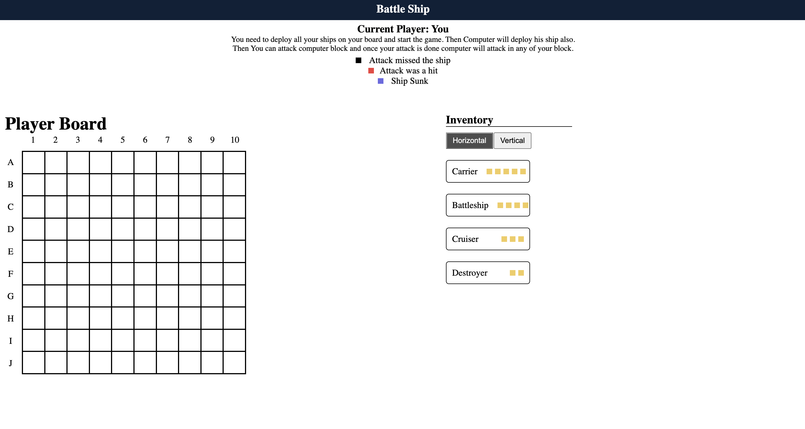

## Battleship!

## Motivation!

This is a game i built when i was interviewing with a company as per their assesment requirement. This is just the basic things that works , but there are lot of places the game can be improved. Feel free to fork and update and modify the game in your own way

## Requirement!

Build a simple React-based version of the game Battleship. Introduce other libraries for state management, styling, etc as you see necessary.

In Battleship we have a board which is a 10x10 grid, where the rows are labeled with a letter (A-J), and the columns with a number (1-10). There are different types of ships which each take up a different number of spaces on this grid, and the number of spaces a ship takes up is equivalent to how many hits the ship can take before sinking. So for a battleship, it takes up 4 spaces on the board, and can be hit 4 times before sinking. The players place their ships on the board in a random configuration, and then in turns, announce a square (for instance C3) where they will attack. If any of the opponent's ships are on that square, that ship will take one hit. Once a ship has a hit on each space it takes up, it will sink. Once a player's ships are all sunk, they lose.

We give you a basic board setup and an 'inventory' of 4 ships as follows for yourself and for the 'computer' player:

- 1 carrier: size 5 spaces for hits

- 1 battleship: size 4 spaces for hits

- 1 cruiser: size 3 spaces for hits

- 1 destroyer: size 2 spaces for hits

Made with ♥ by [Anamul Haque](https://twitter.com/ishraqe_manjur)
